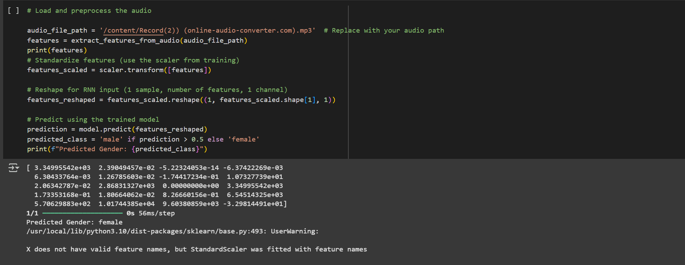

# Deep Learning Gender Recognition

This project is a **team-based deep learning project** for classifying gender (male/female) from voice data.  
The **main work** is provided in a Jupyter/Colab notebook.  
My main contribution was focused on **data preprocessing, feature engineering, and dataset preparation** to ensure high-quality inputs for training the deep learning model.

---

## Features
- **Data preprocessing**: cleaning, encoding labels, handling features.
- **Feature engineering**: extracting relevant audio features (spectral, statistical, etc.).
- **Dataset preparation**: splitting into training/testing sets, scaling, and reshaping data for RNN input.
- **Visualization**: correlation heatmaps and exploratory data analysis.
- RNN-based deep learning model for binary classification (male vs female).
- Model evaluation with accuracy, AUC, and confusion matrix.

---

## Project Structure
```
DLProject/
│
├── dlproject.ipynb       # Main notebook (Colab / Jupyter)
├── dlproject.py          # Python script for optional local run
├── requirements.txt      # Dependencies
├── images/               # Output
└── README.md             # Project documentation
```

---

## Requirements
Install dependencies with:

```bash
pip install -r requirements.txt
```

---

## How to Run
1. Clone the repository:
   ```bash
   git clone https://github.com/<xlwynee>/Voice-Gender-Classification.git
   cd Voice-Gender-Classification
   ```
2. Run the notebook in Jupyter/Colab (main workflow).  
3. (Optional) Run the Python script:
   ```bash
   python dlproject.py
   ```

---

## Demo
Below is an example output visualization from the project:



---

## Author
- **Leena Alotaibi**  
  📧 leenanalotaibi@gmail.com  
  💻 GitHub: [xlwynee](https://github.com/xlwynee)

> Note: This was a **team project**, and my primary responsibility was in **data preparation and preprocessing**.
